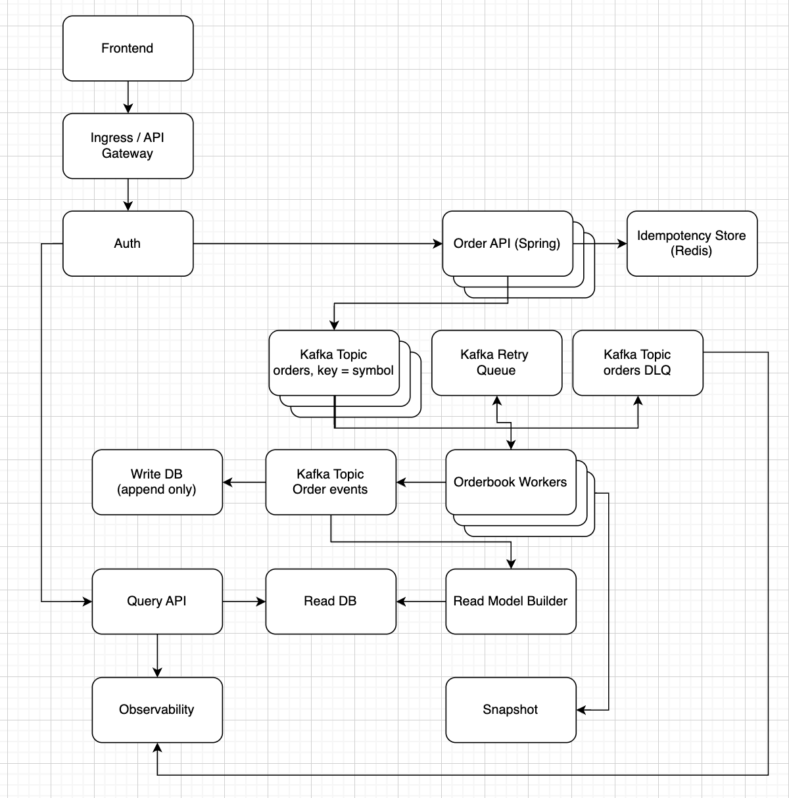

# Architecture

## Architecture Workflow

This project implements an event-driven order book using Kafka + CQRS. The system is split into a write path (accept orders), a matching path (stateful matching engine), and a read path (query-optimized views).

## Components

- **Frontend**: client/UI that submits orders and queries book state.
- **Ingress / API Gateway**: edge routing, TLS termination, rate limiting, request size limits.
- **Auth**: validates identity/permissions (e.g., JWT/OAuth).
- **Order API (Spring)**: stateless HTTP service that validates commands and publishes them to Kafka.
- **Idempotency Store (Redis)**: prevents duplicate order creation when clients retry.
- **Kafka Topic: orders (key = symbol)**: command stream (place/cancel/replace). Partitioning by symbol preserves ordering per instrument.
- **Orderbook Workers**: stateful matching engines (Kafka consumer group). Each partition is owned by exactly one active consumer → deterministic processing per symbol.
- **Kafka Retry Queue**: retry path for transient failures with backoff (implementation-dependent).
- **Kafka Topic: orders DLQ**: dead-letter queue for poison messages or permanently failing commands.
- **Kafka Topic: order-events**: immutable facts produced by the matching engine (accepted/rejected/filled/trades/cancelled).
- **Write DB (append-only)**: durable storage for audit/compliance/debugging (optional if Kafka is treated as the primary event log, but commonly used).
- **Read Model Builder**: consumes order-events and builds queryable projections.
- **Read DB**: query-optimized storage (open orders, trades, L2/L3 book views, etc.).
- **Query API**: serves read endpoints from the Read DB.
- **Snapshot store**: periodic snapshots of in-memory order book state for fast recovery.
- **Observability**: metrics/logs/traces across services (e.g., Prometheus/Grafana/OTel).

## End-to-End Flow

### 1) Submit an Order (Write Path)

The Frontend sends an HTTP request to place an order (buy/sell).

The request enters through Ingress/API Gateway and then Auth validates access.

The Order API:
- validates the payload (symbol, side, price, quantity, etc.)
- checks idempotency in Redis (e.g., using a clientOrderId + account/user key)
- generates/returns a server orderId (or returns the previously-created order if it's a replay)

The Order API publishes a command message to Kafka orders using symbol as the message key.

**Important**: Kafka partitioning by symbol ensures that all commands for a given symbol are processed in strict order by exactly one active consumer.

### 2) Match and Emit Results (Matching Path)

Orderbook Workers consume commands from the orders topic as a consumer group:

- Each Kafka partition is assigned to a single active worker instance.
- Each worker maintains in-memory order book state for the symbols in its assigned partitions.
- The worker processes each command deterministically (e.g., place order, cancel order):
  - updates the in-memory book
  - performs matching (buy vs sell)
  - produces outcomes as events (accepted/rejected/partial fill/fill/trade executed/cancelled)
- The worker publishes these outcomes to Kafka order-events (and optionally a separate trades topic if you want trades isolated).

### 3) Persist and Project (Event + Storage Path)

order-events are treated as the "facts" stream. From here:

- They may be persisted to the Write DB (append-only) for audit/debugging/analytics.
- They are consumed by the Read Model Builder to update queryable read models in the Read DB.

The Write DB is not on the hot path of matching. Matching happens in-memory in the workers; persistence is downstream of the event stream.

### 4) Query State (Read Path)

The Frontend calls Query API endpoints (also via Gateway/Auth).

Query API reads from the Read DB to serve:
- current book views (L2/L3, best bid/ask, depth)
- open orders by user/account
- historical trades/fills
- order status

This separation allows the read side to scale independently and be optimized for queries without impacting matching latency.

## Failures, Retries, and DLQ

### Retry Queue (Transient Failures)

If a command fails due to a transient condition (temporary downstream outage, temporary schema/serialization issue, etc.), the worker can route it to a Kafka Retry Queue. After a backoff period the message is reprocessed.

(Implementation options: dedicated retry topics per delay, Kafka headers + scheduling, or framework-level retry handlers.)

### DLQ (Poison Messages)

Commands that fail permanently (invalid payload, unsupported operation, repeated failures beyond max retries) go to the Kafka DLQ for:
- inspection/debugging
- manual replay after fixing data/code
- auditing

## Snapshots and Recovery

The worker's state is in-memory, so recovery is critical:

- Workers periodically write snapshots of the order book state (per symbol/partition) to the Snapshot store.
- On restart/rebalance:
  - a worker loads the most recent snapshot for its partitions/symbols
  - then replays Kafka from the last known offset (or snapshot marker) to catch up

This keeps restarts fast while preserving the Kafka event log as the source of truth.

## Observability

All services emit telemetry:

- **metrics**: request rates, Kafka lag, matching latency, p99/p999, GC, queue depths
- **logs**: command IDs, correlation IDs, error diagnostics
- **traces**: request → command → worker processing → event emission

Observability is not part of the critical path, but it's essential for diagnosing performance and correctness issues.
